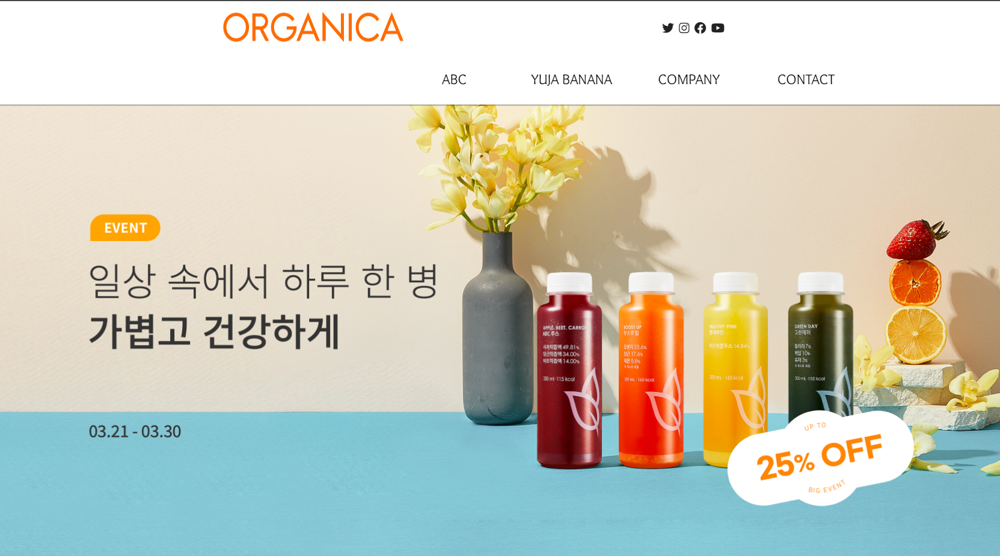

# FED-REAL-PJ-SHW
## 최종본

 

## 1. 1차 프로젝트

### 링크 
#### 완성품: Click [here](https://seo-001.github.io/FED-REAL-PJ-SHW/01.%EA%B0%9C%EC%9D%B8%ED%94%84%EB%A1%9C%EC%A0%9D%ED%8A%B8_%EC%84%9C%ED%95%B4%EC%9B%90/)  
#### 디렉토리:Click [here](https://github.com/Seo-001/FED-REAL-PJ-SHW/blob/main/01.%EA%B0%9C%EC%9D%B8%ED%94%84%EB%A1%9C%EC%A0%9D%ED%8A%B8_%EC%84%9C%ED%95%B4%EC%9B%90/index.html)
#### ppt: Click [here](https://seo-001.github.io/FED-REAL-PJ-SHW/01.%EA%B0%9C%EC%9D%B8%ED%94%84%EB%A1%9C%EC%A0%9D%ED%8A%B8_ppt/%EA%B0%80%EC%9D%B4%EB%93%9C%20%EB%AC%B8%EC%84%9C_%EC%84%9C%ED%95%B4%EC%9B%90.pdf)
#### 원본(주제사이트): Click [here](https://www.organica.kr/)

### 설명 :
#### 1) 올가니카, 클렌징 주스를 주제사이트로 선정함
#### 2) 과일의 색감을 UI로 표현함 
#### 3) HTML, CSS, 자바스크립트를 사용함 
#### 4) 스크롤 이벤트를 통해 UI를 구현함  
 

## 2. 2차 프로젝트 

### 링크 : 
#### 완성품: Click [here](https://seo-001.github.io/FED-REAL-PJ-SHW/02.2%EC%B0%A8%EA%B0%9C%EC%9D%B8%ED%94%84%EB%A1%9C%EC%A0%9D%ED%8A%B8/index.html)  
#### 디렉토리:Click [here](https://github.com/Seo-001/FED-REAL-PJ-SHW/blob/main/02.2%EC%B0%A8%EA%B0%9C%EC%9D%B8%ED%94%84%EB%A1%9C%EC%A0%9D%ED%8A%B8/index.html)
#### ppt: Click [here](https://seo-001.github.io/FED-REAL-PJ-SHW/02.2%EC%B0%A8%EA%B0%9C%EC%9D%B8%ED%94%84%EB%A1%9C%EC%A0%9D%ED%8A%B8_ppt/2%EC%B0%A8%ED%94%84%EB%A1%9C%EC%A0%9D%ED%8A%B8.pdf)
#### 원본(주제사이트): Click [here](https://printbakery.com/)

### 설명 :
#### 1) 프린트베이커리(미술작품)를 주제사이트로 선정함
#### 2) 프린트베이커리라는 브랜드 이름에 맞게 UI를 표현함 
#### 3) HTML, CSS, 자바스크립트, Vue를 사용함 
#### 4) 메인페이지와 서브페이지 2가지로 분리함 
 

## 3. 3차 프로젝트 

### 링크 : 
#### 완성품: Click [here](https://seo-001.github.io/react03/)  
#### 디렉토리:Click [here](https://github.com/Seo-001/react03/blob/main/index.html)
#### ppt: Click [here](https://seo-001.github.io/FED-REAL-PJ-SHW/03.3%EC%B0%A8%ED%94%84%EB%A1%9C%EC%A0%9D%ED%8A%B8_ppt/3%EC%B0%A8%20%ED%94%84%EB%A1%9C%EC%A0%9D%ED%8A%B8_ppt.pdf)
#### 원본(주제사이트): Click [here](http://bstudio-company.com/)

### 설명 :
#### 1) 비스튜디오컴퍼니를 주제사이트로 선정함
#### 2) 컴포넌트로 구성함
#### 3) HTML, CSS, 자바스크립트, REACT 를 사용함 
#### 4) SPA(Single Page Application)를 사용함  

